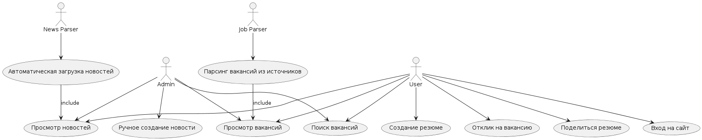
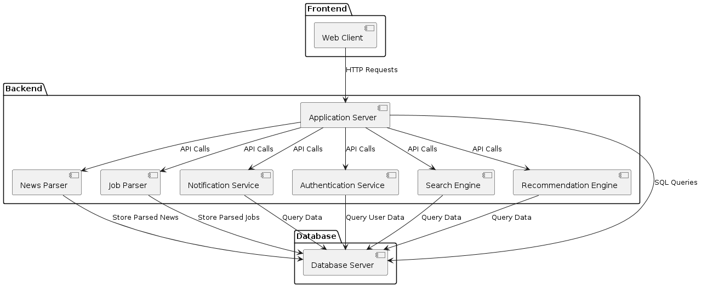
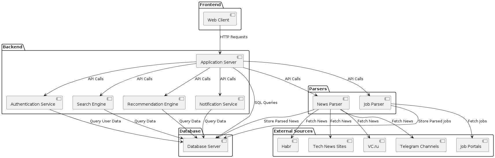

# CHP_Roaring-Kitty-Live-Stream

## Документация
- Техническая спека: https://docs.google.com/document/d/1mnMkRws0dFS5KSmPPbDuwFTjy65xhCMsUxIpC1fHlEw/edit?usp=sharing
- Use Case Diagram: https://www.plantuml.com/plantuml/uml/SyfFKj2rKt3CoKnELR1Io4ZDoSa70000
- 


## Backend
1. api_fast_swag - 
2. fastApi + OpenAPI с авторизацией и микросервисной архитектурой
3. webapp-conversation - AI module - ассистент HR

Доступен: http://176.123.166.154:8000/docs

## Frontend
1. Frontend-dump - заглушка дизайна для первой страницы
2. Preline UI v2 React Router - пример библиотеки на tailwind
3. template_html - пример страницы приземления сервиса

Доступен: http://176.123.166.154:3000/

## Схемы






## Предложение для реализация платформы

Для использование платформы для работы HR-агенства предлагается использовать OSS решение
<a href='https://lct2421.frappehr.com/app/hr'>FrappeHR, тестовый контур</a>
```
логин: saleksey67@gmail.com
пароль: T47ARf5oBQ2
```

